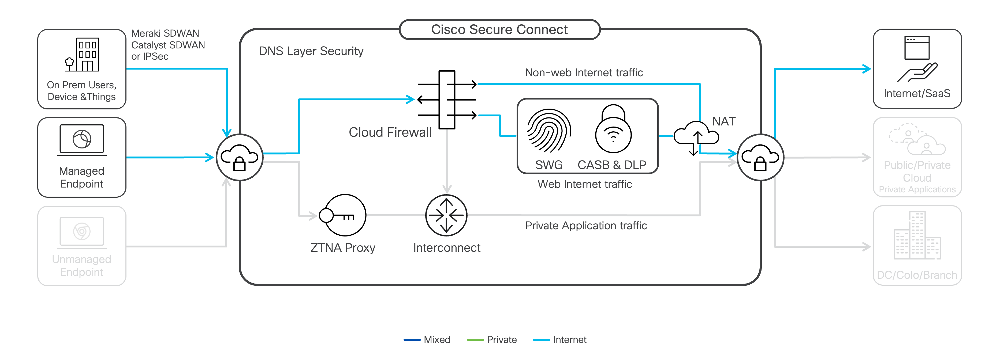
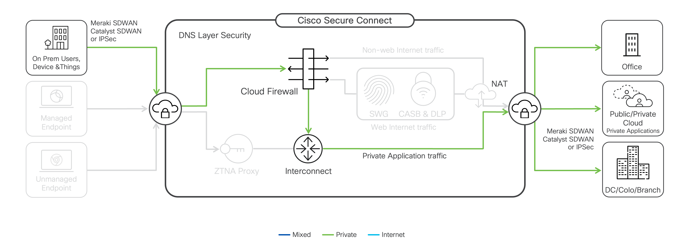
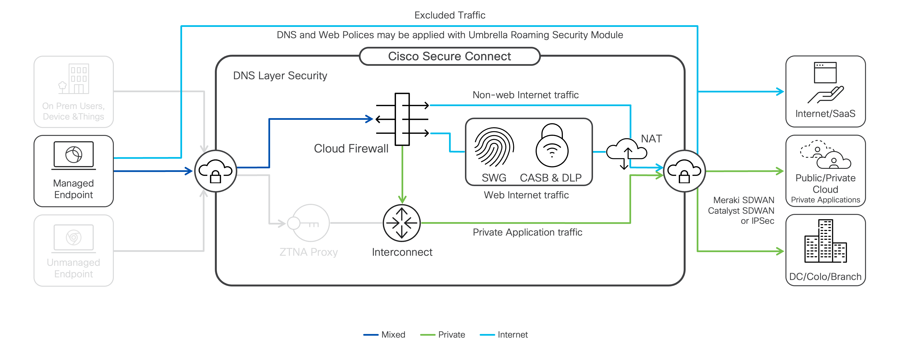

## What is Cisco Secure Connect?

Cisco Secure Connect is a unified Secure Access Service Edge (SASE) product designed to deliver an unparalleled user experience with minimal effort by securely connecting users, things, and applications seamlessly from anywhere. 

It combines networking, security, and unified visibility with client and branch office connectivity in a single, turnkey SASE solution that is quick to deploy and easy to manage - reducing costs and complexity, enabling digital business, and increasing staff effectiveness.

## Site Interconnect

Network interconnect provides intelligent routing between sites connected to the Secure Connect network fabric. 

## Secure Remote Access

Secure Connect provides secure access to private network destinations and applications for remote workers via client-based tunnels.

